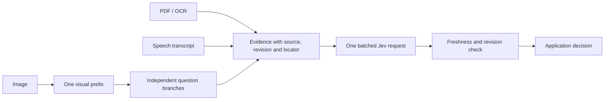

# Jev + Multimodal

**Answer many questions about an image without generating a caption. Feed compact visual, document, and transcript evidence into Jev.**

[](https://github.com/Alpha-Harper-Franklin/jev-multimodal/actions/workflows/ci.yml)
[Source review 中文](research/SOURCE_REVIEW.zh-CN.md) · [Measurements](benchmarks/README.md) · [Credits](THIRD_PARTY.md)

Working CUDA visual decisions, a hosted TypeSafe Jev adapter, provenance and freshness handling, a CLI, and recorded experiments on public images. **Hosted Jev remains text-only.** Local visual decisions use Qwen2.5-VL; the optional Jev stage receives extracted evidence.

## Measured on real images

One RTX 4090, Qwen2.5-VL-7B, 64 COCO images from a deterministic POPE random subset, six questions per image. The last 32 images / 192 questions form the isolated test split. This is a development experiment, not the full POPE benchmark.

| Pipeline | Test accuracy | Median time per image, six questions |
|---|---:|---:|
| Qwen independent visual forwards | 91.15% | 611 ms |
| Qwen shared visual prefix + batched question branches | 91.15% | **160 ms** |
| Qwen generic caption → Jev | 84.90% | 3,134 ms¹ |
| Qwen compact visual evidence → Jev | **91.15%** | **1,104 ms¹** |

Shared computation gave **3.81× paired median speedup** over independent visual forwards. A single-image scaling diagnostic with 64 repeated questions gave 6,780 → 594 ms; repeated questions are not extra accuracy samples. At one question, cache setup was slower than an independent forward.

¹ Hosted pipeline timing sums separately measured frontend and API components, not single-process wall time. API phases ran separately with two workers. Both final hosted pipelines returned 64/64 validated responses; earlier failures are retained. See [the full report](benchmarks/README.md).

Direct visual inference remains fastest and has the same test accuracy as the Jev bridge. Compact evidence uses **1.73× the input tokens of captions** here. Jev is useful when an application needs further semantic decisions over combined evidence; adding it is not automatically an improvement.

## Quick start

Python 3.10+. Measured vision runtime: Torch 2.13.0+cu130 / Transformers 5.15.0. Supply an existing local Qwen2.5-VL checkpoint; weights are not downloaded automatically.

```bash
git clone https://github.com/Alpha-Harper-Franklin/jev-multimodal.git
cd jev-multimodal
python -m pip install '.[vision]'
python -m jev_multimodal vision --model /path/to/Qwen2.5-VL-7B-Instruct --image /path/to/image.jpg --questions examples/questions.json --output runs/visual.json
```

```python
from jev_multimodal import Question
from jev_multimodal.cuda_qwen import QwenVision
from jev_multimodal.evidence import Snapshot, visual_evidence
from jev_multimodal.typesafe import JevClient

questions = [
    Question.yes_no("person", "Is there a person in the image?"),
    Question.yes_no("bicycle", "Is there a bicycle in the image?"),
]
vision = QwenVision("/path/to/Qwen2.5-VL-7B-Instruct")
result = vision.judge("image.jpg", questions)

# Optional: set TYPESAFE_API_KEY in this process's environment.
evidence = visual_evidence(result, source_id="frame-1", revision="1", questions=questions)
decision = JevClient().judge(Snapshot(evidence), questions)
```

Choice supports 2–26 candidates, Noul uses yes/no, and a request holds 1–64 questions. **Score is not implemented.** Local probabilities are conditional candidate scores, not calibrated correctness. Include an explicit `unknown` Choice candidate when the task permits it.

## Documents and speech

```bash
python -m pip install '.[documents]'
python -m jev_multimodal extract pdf document.pdf --source-id document --revision 1 --output runs/document.json
# Tesseract must also be installed on the system.
python -m jev_multimodal extract ocr screen.png --source-id screen --revision 1 --output runs/screen.json
# This checked-in transcript is an authored API fixture, not recorded audio.
python -m jev_multimodal extract transcript examples/transcript.json --source-id speech --revision 1 --output runs/speech.json
python -m jev_multimodal judge --evidence runs/speech.json --questions examples/transcript_questions.json --output runs/speech-decisions.json
```

Optional local audio recognition uses `pip install '.[audio]'` and `extract audio recording.wav --asr-model /path/to/faster-whisper ...`. PDF extraction preserves page numbers and marks textless pages `needs_ocr`; OCR preserves word boxes and engine scores; transcript/audio adapters preserve segment times. Raw image/audio bytes are never sent to hosted Jev.

OCR/PDF/ASR adapters are implemented but **have not received end-to-end extraction validation in the release environment**. Validated paths are real-image Qwen inference, visual-evidence→Jev, caption→Jev, and the transcript import/API fixture. There is no live camera loop, native video backbone, robot controller, or trained model released here.

## Evidence stays tied to its source



`Snapshot` rejects conflicting source revisions and duplicate locators. `RevisionGate` lets asynchronous callers drop superseded replies, even when a later capture contains identical bytes. Pass a real acquisition timestamp and `max_age_s` to check freshness before and after an API call; timestamps are not invented for prerecorded files. Callers must use the revision gate when applying asynchronous results.

`ExtractionCache` keys reuse on content plus extractor version/options and returns isolated copies. No visual KV cache is reused between requests. The hosted client validates IDs, answer types and probability distributions, rejects oversized evidence instead of truncating it, and performs no hidden retry or fallback. Provenance identifies a source; it does not prove correctness.

## Reproduce

```bash
python -m unittest discover -s tests -v
python experiments/download_pope.py --output runs/pope64 --images 64
python experiments/verify_shared.py --model /path/to/model --manifest runs/pope64/manifest.jsonl --output runs/parity.json
python experiments/run_pope.py --model /path/to/model --manifest runs/pope64/manifest.jsonl --output runs/paired
python experiments/analyze_pope.py --predictions runs/paired/predictions.jsonl --labels runs/pope64/labels.jsonl --output runs/summary.json
```

See [benchmark reproduction](benchmarks/README.md) for caption and hosted API experiments. Use new output paths. Ground truth never enters inference. Temperature fits use calibration image groups only; they do not change argmax accuracy or guarantee calibration elsewhere. BF16 transformer branching is numerically approximate: 383/384 choices agreed with independent forwards in this run.

## What was borrowed

The investigation returned **555 distinct repository search results** and pinned **57 source snapshots**, including projects with OCR, speech, DOM, gesture or robot observation paths. This is a bounded search, not an exhaustive internet census. [The audit](research/SOURCE_REVIEW.zh-CN.md) distinguishes pixel models, text evidence bridges, privileged simulator state, prototypes and unsupported README claims.

Shared visual prefixes, batched branches, candidate readout and temperature scaling are existing community techniques. This release integrates and measures them; it does not claim to invent them or reproduce TypeSafe's undisclosed training algorithm. Third-party performance numbers are not presented as independently reproduced.

## 中文

可运行的 Jev 多模态接口与实验基线：图片先在本地共享视觉计算，再按需把紧凑证据交给 Jev。目前实测重点是多问题吞吐、证据形式、概率校准和输入新鲜度。不是新训练的多模态基础模型，也没有驾驶或机器人闭环成绩。后续需要补齐真实时序、多模态冲突、分布变化与训练决策头比较，不能由这批小样本结果推出顶会或通用性能结论。

Independent community project, not affiliated with TypeSafe. MIT code; external models, libraries and datasets retain their own licenses. See [THIRD_PARTY.md](THIRD_PARTY.md).
