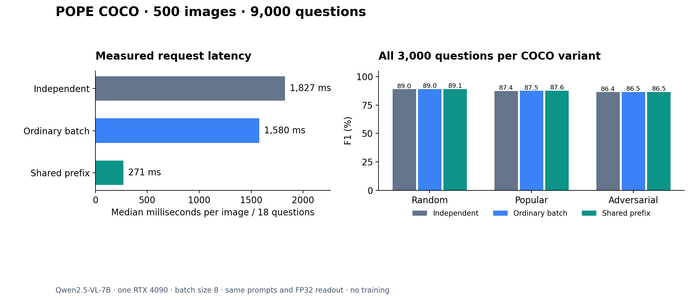

# Complete COCO POPE variants

500 images, 9,000 source question IDs, three inference modes and **27,000 recorded answers**. Every COCO random, popular and adversarial annotation is included. This is the COCO portion of POPE, not all dataset families. No training was performed.



## Main comparison

| Mode | All accuracy | All F1 | Test accuracy | Request p50 / p95 |
|---|---:|---:|---:|---:|
| Independent full forwards | 88.48% | 87.57% | 87.89% | 1,826.9 / 2,136.6 ms |
| Ordinary full-prompt batches | 88.52% | 87.63% | 87.93% | 1,579.9 / 2,088.2 ms |
| Shared visual prefix | 88.59% | 87.69% | 87.91% | 271.2 / 294.4 ms |

Each request contains all 18 annotated questions for one image. Latency includes loading/preprocessing the image, prefix/cache work, full-vocabulary readout and CUDA synchronization; it excludes initial model loading. Identical question strings occur across variants, so 9,000 IDs are not 9,000 independent problems. There are 5,127 distinct image/prompt pairs.

Shared versus ordinary batching: **5.948× paired median speedup**, image-bootstrap 95% interval [5.899, 6.183]. Shared versus independent forwards: 6.831×. Bootstrap resamples image groups within this single run; it does not measure run-to-run or hardware uncertainty.

On the test split, shared-minus-batched accuracy is -0.022 percentage points, paired image-bootstrap interval [-0.267, +0.200]. There are 11 choice flips: 5 improve and 6 regress. The method reduces repeated computation; a general accuracy improvement is not established.

| COCO variant | Independent F1 | Ordinary batch F1 | Shared-prefix F1 |
|---|---:|---:|---:|
| random | 88.97% | 89.01% | 89.08% |
| popular | 87.41% | 87.46% | 87.58% |
| adversarial | 86.38% | 86.47% | 86.45% |

Each variant has 3,000 annotated questions. Positive questions and some negatives recur across variants; uncertainty estimates keep each image's variants together.

## Protocol and limits

- Qwen2.5-VL-7B-Instruct; BF16 transformer, SDPA, FP32 final vocabulary projection. Same prompts, candidate letters, image resolution and batch size eight in all modes.
- `independent` recomputes vision and language for every question. `batched` repeats full image/prompt inputs in ordinary length-bucketed microbatches. `shared` computes the image/context prefix once and branches the cache into suffix microbatches. This is not a comparison against vLLM, SGLang or every community implementation.
- One RTX 4090 on a shared host. Other GPUs were occupied by other jobs. All three modes run on the same GPU with rotating mode order and one first-image warmup for every mode.
- The downloader pins POPE annotations, samples the full image list with seed `20260921`, and assigns the first 250 images to calibration and the last 250 to test. Labels and split metadata are read only by offline analysis.
- Of the prior 64 development images, 62 occur in calibration and 2 in test. Removing previously used test images leaves **248 images / 4,464 questions**, with shared accuracy **87.88%**. This additional slice is explicitly a development-overlap check, not a newly collected dataset. Pretraining overlap is unknown.
- BF16 computation is approximate. Shared/ordinary-batched choice agreement is 99.69%, maximum yes-probability difference 0.156572. These differences can matter near a decision threshold.
- Within shared-mode requests, 2338 prompt groups repeat; 1 have inconsistent choices across their copies, with maximum probability range 0.023470. See raw records rather than assuming identical numerical execution for different microbatch shapes.
- One-image question-count scaling repeats question text intentionally. It is a throughput diagnostic, not additional accuracy evidence.

## Calibration and abstention

Temperature is fit on calibration images only. For shared inference, test Brier is 0.09906 → 0.08844, NLL 0.46162 → 0.29575, and ten-bin top-label ECE 0.07802 → 0.01252. Temperature does not change argmax decisions.

Routing chooses the lowest threshold from a fixed grid meeting an empirical calibration-error target with at least 50 accepted calibration questions. It is not a guaranteed risk bound. The grid, all targets (10%, 5%, 2%) and all variant breakdowns are retained in [routing.json](routing.json).

- All-variant calibration, empirical 5% calibration error target: chosen threshold `0.85`; test coverage 71.58%, accepted errors 150/3221, accepted error rate 4.66%.
- Random-only calibration, empirical 5% calibration error target: chosen threshold `0.8`; test coverage 76.53%, accepted errors 186/3444, accepted error rate 5.40%.

The random-only fit probes transfer to popular/adversarial negative sampling on disjoint test images. It is a limited sampling-shift diagnostic, not a cross-dataset generalization result. Abstentions are counted, not silently replaced by correct answers from an oracle or a stronger model.

## Artifacts and reproduction

[Raw predictions](predictions.jsonl) · [Summary](summary.json) · [Environment and source hashes](environment.json) · [Dataset receipt](dataset-receipt.json) · [Completion](complete.json) · [Scaling](scaling.json) · [SVG figure](comparison.svg).

```bash
python -m pip install '.[vision,analysis]'
python experiments/download_pope.py --images 500 --variants random popular adversarial --output runs/pope500
python experiments/run_pope.py --model /path/to/Qwen2.5-VL-7B-Instruct --manifest runs/pope500/manifest.jsonl --output runs/full
python experiments/download_pope.py --images 64 --output runs/pope64
python experiments/analyze_pope.py --predictions runs/full/predictions.jsonl --labels runs/pope500/labels.jsonl --development-labels runs/pope64/labels.jsonl --output runs/full/summary.json
python experiments/analyze_routing.py --predictions runs/full/predictions.jsonl --labels runs/pope500/labels.jsonl --output runs/full/routing.json
python experiments/plot_results.py --summary runs/full/summary.json --output runs/full/comparison
```

Use fresh output directories. Images, model weights, private paths and API credentials are not redistributed. These measurements use local visual inference and do not include a Jev API stage; the separate [64-image hosted comparison](../README.md) measures that bridge.
